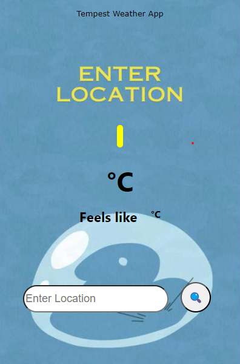
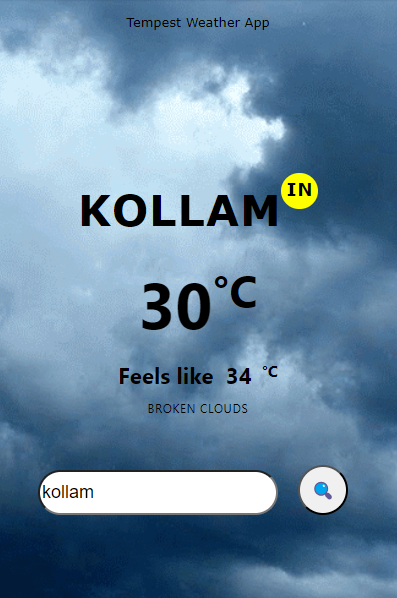

# Tempest Weather Extension
This Weather App utilizes the OpenWeatherMap API to retrieve real-time weather data based on user-inputted locations. Below is a concise explanation of the key components and functionalities:

## Initial page of the extension:

## After input

### Note:
- Ensure that the API key is kept secure and not exposed publicly to maintain data integrity and security.
- Background images are stored in the "images" folder and are referenced accordingly.
